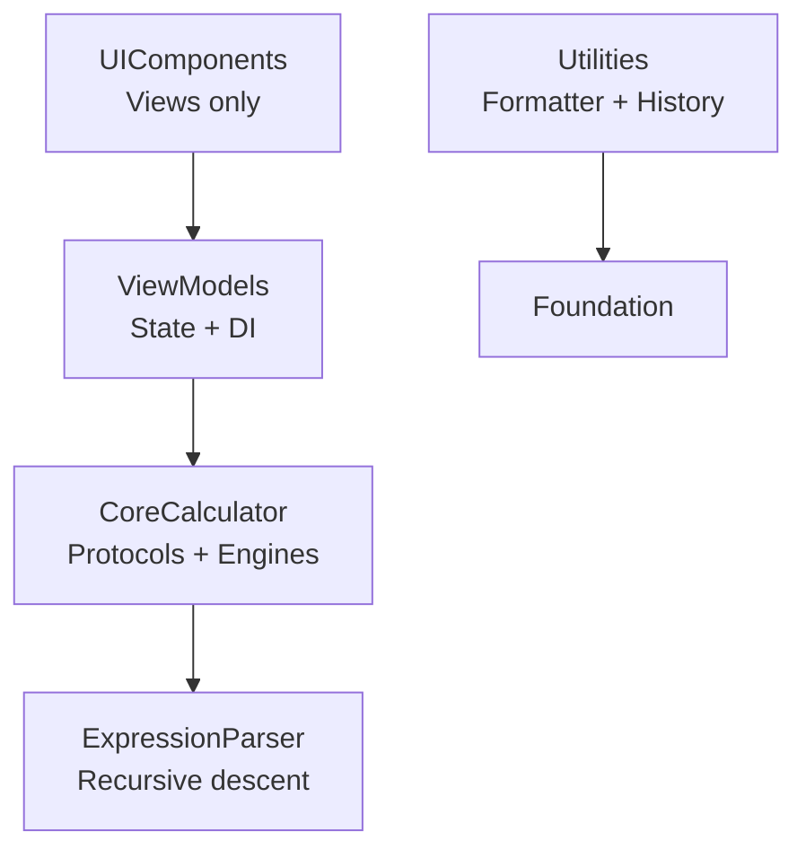
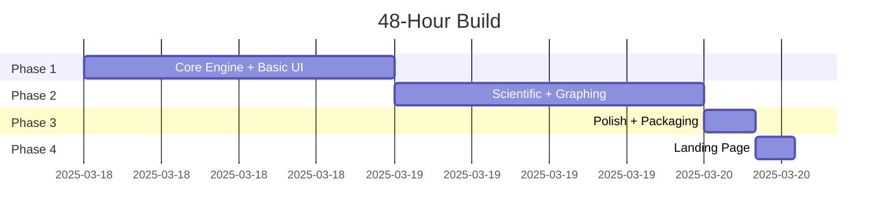

**TitleRedactedCalc PRD v3.0**  
**Platform:** macOS 14+ • **Stack:** Swift 6 + SwiftUI • **Zero deps** • **Ship:** 2 days  

### Architecture (SOLID + Modular)

**SOLID applied:**  
S – one job per file  
O – new modes via extension only  
L – engines interchangeable  
I – tiny CalculatorEngine protocol  
D – VM depends on protocol only  

### Delivery Timeline

### Features > User Stories > Tasks

**Feat-01 Core Engine & SOLID**  
US-01: CalculatorEngine protocol (process/evaluate/reset)  
 • ST-01-01: Scaffold Xcode project (30 min)  
 • ST-01-04: Write protocol + Basic/Scientific/Graphing impls (2 h)  
US-02: ViewModel with DI  
 • ST-01-08: @Observable init(engine:) + unit tests (30 min)  

**Feat-02 Basic UI**  
US-06–09: Display + 4×5 grid + keyboard + fixed 340×520 window  
 • ST-02-01: CalculatorDisplay.swift (30 min)  
 • ST-02-03: ButtonGrid + style (45 min)  
 • ST-02-06: Keyboard modifier (30 min)  

**Feat-03 Scientific Mode**  
US-10–13: Segmented toggle + trig/log buttons + Deg/Rad + history  
 • ST-03-03: ModeToggle + animation (20 min)  
 • ST-03-05: ScientificButtonGrid (45 min)  
 • ST-03-09: HistoryStore + view (20 min)  

**Feat-04 Graphing Mode**  
US-14–17: Live y=f(x) plot + axes + pinch/pan + crosshair  
 • ST-04-02: GraphViewModel + samplePoints (20 min)  
 • ST-04-04: Chart + LineMark (40 min)  
 • ST-04-08: Magnify/Drag gestures (30 min)  

**Feat-05 Polish & Accessibility**  
US-18–20: VoiceOver labels + animations + ⌘C/⌘V menus  
 • ST-05-01: Accessibility on all buttons (30 min)  
 • ST-05-06: Commands block (30 min)  

**Feat-06 Packaging**  
US-21–23: Signed DMG + build.sh + notarisation  
 • ST-06-10: build.sh pipeline (30 min)  
 • ST-06-11: Test clean Mac install (20 min)  

**Feat-07 Landing Page**  
US-24–25: Hero + screenshots + DMG link + Lighthouse ≥90  
 • ST-07-01: index.html + OG tags (30 min)  

**Definition of Done** (all stories): PR merged • AC verified • zero warnings • Accessibility Inspector clean • unit tests pass • Conventional Commits • Dark/Light tested • no deps.  

Ready for engineering.
