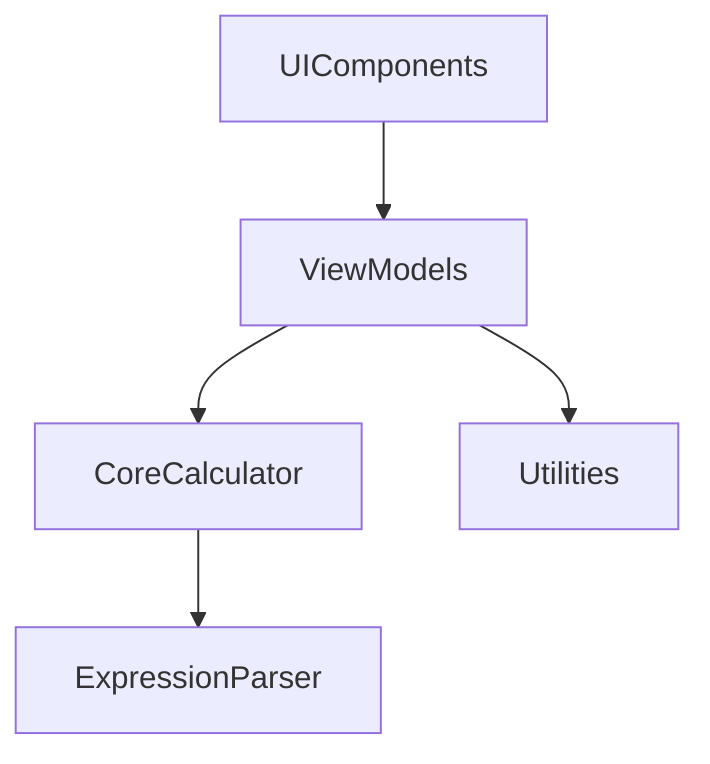
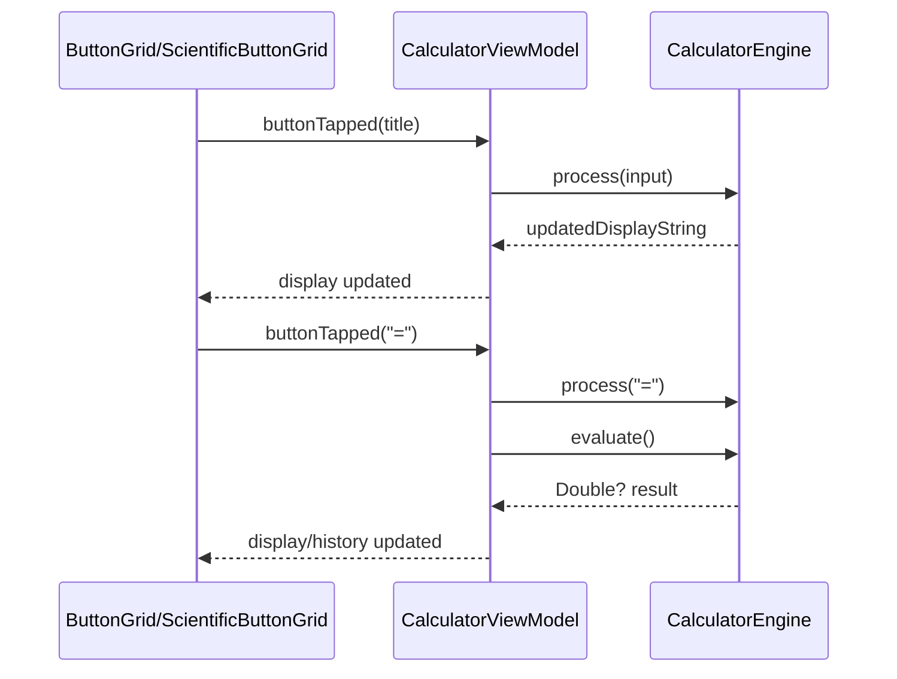
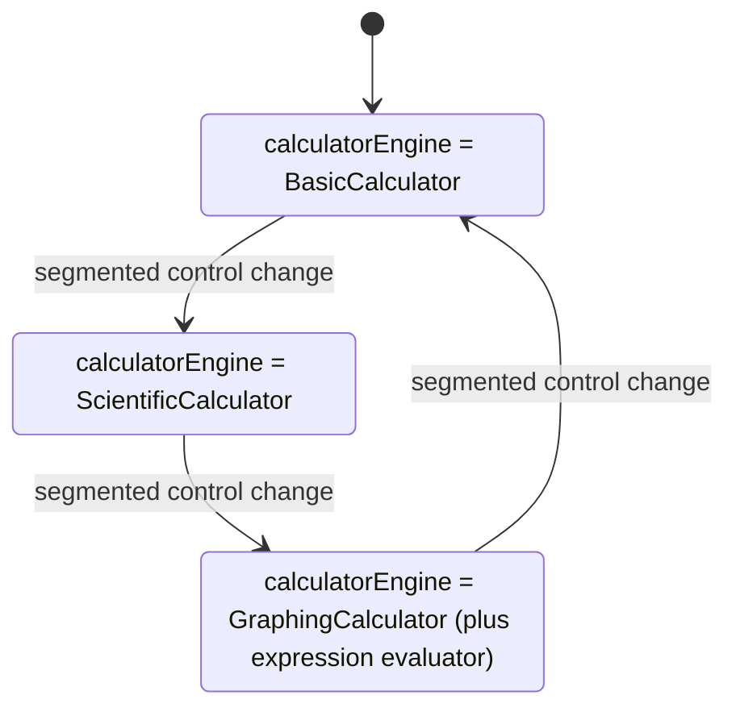
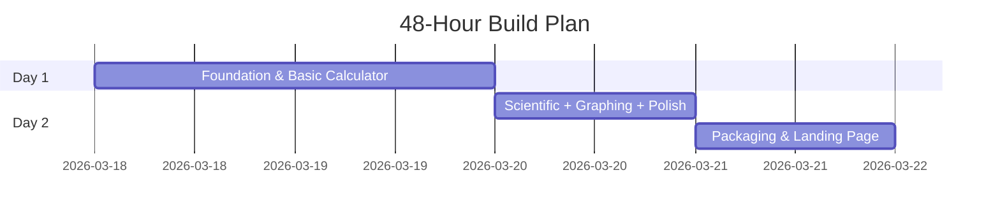

# TitleRedactedCalc PRD v2.0

**Confidential / Engineering Edition**

> Consolidated PRD for engineering execution: epics > features > user stories > tasks.
>
> Sources:
>
> - [`docs/PRD.md`](docs/PRD.md) (delivery framing)
> - [`docs/TitleRedactedCalc_PRD_v2.docx`](docs/TitleRedactedCalc_PRD_v2.docx) (authoritative backlog, acceptance criteria, subtasks)
> - [`docs/TitleRedactedCalc_ProductOverview.docx`](docs/TitleRedactedCalc_ProductOverview.docx) (executive summary, success metrics, risks)
> - [`SNIPPETS.md`](SNIPPETS.md) (implementation truth and module paths)

## Executive Summary

TitleRedactedCalc is a native macOS calculator built entirely in SwiftUI with a pure Swift math engine. It ships as one app with three progressive modes: **Basic**, **Scientific**, and **Graphing**, plus a landing page and a DMG installer.

The goal is to remove friction and context switching versus web calculators by delivering a keyboard-first, accessible, and native-feeling experience (dark/light mode, VoiceOver, macOS menu commands).

## Success Metrics

| Metric | Target | How We Measure |
|---|---:|---|
| Downloads (Month 1) | 500+ | GitHub release page download counter |
| Lighthouse Score | >= 90 all categories | Chrome DevTools audit on landing page |
| App size | < 5 MB DMG | `hdiutil` output, measured pre-release |
| Accessibility | 0 warnings | Xcode Accessibility Inspector audit |
| Graph render time | < 100 ms | Instruments Time Profiler on M1 |
| User satisfaction | >= 4.5 / 5.0 | Feedback form linked from landing page |
| Support tickets (Month 1) | < 10 | GitHub Issues tracker |

## Scope & Out of Scope

### In scope (v2.0)

1. **Basic mode**: 4x5 Apple-like grid, keyboard support, fixed 340x520 window.
2. **Scientific mode**: trig/log/power/roots/constants, DEG/RAD toggle, and last-10 history.
3. **Graphing mode**: real-time graph of `y = f(x)` with pinch/pan zoom and hover crosshair.
4. **Polish**: accessibility labels/hints, animations, error state messaging, and macOS commands.
5. **Packaging & distribution**: Developer ID signing, notarization, DMG creation, `build.sh`.
6. **Marketing landing page**: hero, screenshots, download button, SEO + Open Graph metadata.

### Out of scope (explicit non-goals)

1. Not building a CAS (no symbolic algebra, calculus, or general algebraic manipulation).
2. Not building a subscription product (free download via landing page + DMG; monetization is v2.0+).
3. No data collection (zero telemetry / zero network requests after launch).

## Solution Overview

TitleRedactedCalc is a single codebase and a single window that switches between modes instantaneously and non-destructively (display value persists when switching).

## Technical Architecture & SOLID (Modular Design)

### Design Tenets (SOLID)

- **S (Single Responsibility)**: each file/module owns one job (engines compute, views render, utilities format/store).
- **O (Open/Closed)**: adding a new mode is done via new engines + new views + one enum case (existing logic remains closed to modification).
- **L (Liskov Substitution)**: all engines conform to the same `CalculatorEngine` contract and can be swapped without breaking callers.
- **I (Interface Segregation)**: the shared `CalculatorEngine` protocol stays minimal (`process`, `evaluate`, `reset`).
- **D (Dependency Inversion)**: the view model depends on the protocol abstraction, not concrete engine implementations.

### Module Map (Dependency Direction)

The codebase is organized into four modules with a strict dependency direction (inward, never UI->Core).



### Engine / UI Data Flow



### Graphing Pipeline

```mermaid
flowchart LR
  GV[GraphView] --> GVM[GraphViewModel]
  GVM --> GC[GraphingCalculator]
  GC --> EP[ExpressionParser (recursive descent)]
  GC --> SP[samplePoints (200 points)]
  SP --> CH[Charts LineMark]
  CH --> AO[Axis & grid overlay]
  CH --> CO[Crosshair overlay]
```

### Mode Switching / State Persistence



## Delivery Plan

### 48-Hour Phased Build



### Phase Gates (Manual Verification)

1. **EP-01 -> EP-02 gate**: app launches; engines + view model DI work; all basic inputs render and evaluate correctly.
2. **EP-02 gate**: pixel-perfect display and 4x5 grid; keyboard input works for digits/operators; window is fixed.
3. **EP-03/EP-04 gate**: mode switching works; scientific trig plots correctly; crosshair shows coordinates; history records.
4. **EP-05 gate**: Accessibility Inspector shows zero warnings; menu commands copy/paste; animations are smooth.
5. **EP-06 gate**: DMG installs cleanly without Gatekeeper warnings on a clean Mac.
6. **EP-07 gate**: landing page renders correctly (incl. mobile); Lighthouse >= 90; DMG link works end-to-end.

## Epics > Features > User Stories > Tasks

### EP-01: Core Calculator Engine & SOLID Architecture

**Goal:** Define all protocols, data models, and calculator engine implementations.  
**Priority:** Critical | **Phase:** Phase 1 – Day 1 Morning | **Points:** 21 | **Branch Prefix:** `core/`

#### FEAT-01: CalculatorEngine Protocol Suite

**Description:** Define the shared protocol and core engine implementations.  
**Implementation references (SNIPPETS):**

- `Modules/CoreCalculator/Protocols/CalculatorEngine.swift`
- `Modules/CoreCalculator/BasicCalculator.swift`
- `Modules/CoreCalculator/ScientificCalculator.swift`
- `Modules/CoreCalculator/GraphingCalculator.swift`

##### US-01: CalculatorEngine protocol (process/evaluate)

**Acceptance Criteria**

- `CalculatorEngine` protocol exists in `Modules/CoreCalculator/Protocols/`
- `process(_ input: String) -> String` and `evaluate() -> Double?` signatures are correct
- `BasicCalculator`, `ScientificCalculator`, `GraphingCalculator` conform
- All concrete types are final classes
- Zero AppKit imports anywhere

**Tasks**

- `ST-01-01` Create Xcode project, macOS SwiftUI lifecycle (30 min)
- `ST-01-02` Set deployment target to macOS 14.0 (5 min)
- `ST-01-03` Create folder structure under `Modules/` (10 min)
- `ST-01-04` Write `CalculatorEngine.swift` protocol (20 min)

##### US-02: CalculatorViewModel DI

**Acceptance Criteria**

- `CalculatorViewModel.init(engine:)` accepts any `CalculatorEngine`
- Default parameter is `BasicCalculator()`
- `@Observable` macro used (Swift 5.9+)
- No direct UIKit/AppKit references
- Unit test instantiates VM with `MockCalculatorEngine`

**Tasks**

- `ST-01-08` Write `CalculatorViewModel.swift` with `@Observable`, `init(engine:)`, `buttonTapped` (30 min)
- `ST-01-10` Write unit tests covering VM isolation (45 min)

##### US-03: BasicCalculator arithmetic + % + sign toggle

**Acceptance Criteria**

- add/subtract/multiply/divide return correct `Double`
- division by zero returns `"Error"`
- percentage converts current display to `/100`
- sign toggle flips positive/negative
- floating display trimmed (no trailing `.0` on integers)

**Tasks**

- `ST-01-05` Implement `BasicCalculator.swift` arithmetic, percent, sign, C/reset flow (60 min)
- `ST-01-09` Implement `NumberFormatter+Extensions` to clean display strings (20 min)
- `ST-01-10` Add arithmetic and edge-case unit tests (45 min)

##### US-04: ScientificCalculator extends Basic via same protocol

**Acceptance Criteria**

- trig functions supported in DEG and RAD input modes
- includes `log10`, `ln`, `x^2`, `sqrt`, `x^y`, `pi`, `e`
- trig results accurate to at least 10 significant figures
- conforms to `CalculatorEngine` without extra protocol requirements
- swapping engine in VM requires only one code change

**Tasks**

- `ST-01-06` Implement `ScientificCalculator.swift` (sin/cos/tan, log/ln, power, constants) (60 min)
- `ST-01-10` Add trig accuracy unit tests (45 min)

##### US-05: GraphingCalculator expression evaluation across x range

**Acceptance Criteria**

- `evaluateExpression(_ expr: String, x: Double) -> Double?` exists
- supports `x`, `sin(x)`, `cos(x)`, `x^2`, and `x^n`-style forms
- returns `nil` for undefined/complex results
- performance: 200 points evaluated in < 5 ms on M1
- no UI dependencies imported

**Tasks**

- `ST-01-07` Implement expression parser/evaluator + `evaluateExpression` (45 min)
- `ST-01-10` Add evaluation unit tests (45 min)

#### FEAT-02: Dependency Injection ViewModel

**Description:** Ensure the view model can operate with any engine and remains testable in isolation.  
**Implementation references (SNIPPETS):**

- `Modules/ViewModels/CalculatorViewModel.swift`

*(User stories are captured above under the relevant US IDs.)*

---

### EP-02: Basic Calculator UI

**Goal:** Ship a polished, native-feeling basic calculator window.  
**Priority:** Critical | **Phase:** Phase 1 – Day 1 Afternoon | **Points:** 13 | **Branch Prefix:** `feat/basic-ui`

#### FEAT-03: CalculatorDisplay Component

**Description:** Adaptive, right-aligned display view consuming the view model display string.  
**Implementation references (SNIPPETS):**

- `Modules/UIComponents/CalculatorDisplay.swift`
- `Modules/Utilities/NumberFormatter+Extensions.swift` (display formatting)

##### US-06: Large numeric display

**Acceptance Criteria**

- uses SF font, size >= 48pt
- adapts size down if number exceeds 9 digits
- right-aligned within display area
- shows `"Error"` string for invalid operations
- dark/light mode adapts automatically

**Tasks**

- `ST-02-01` Create `CalculatorDisplay.swift` with adaptive font + right alignment (30 min)
- `ST-02-09` Add color assets for dark/light backgrounds (20 min)
- `ST-02-10` Manual test: display sizing and error rendering (30 min)

#### FEAT-04: ButtonGrid Component

**Description:** 4x5 grid with correct layout/colors and hover/press states.  
**Implementation references (SNIPPETS):**

- `Modules/UIComponents/CalculatorButtonStyle.swift`
- `Modules/UIComponents/ButtonGrid.swift`

##### US-07: Apple-like 4x5 layout and button styling

**Acceptance Criteria**

- grid matches Apple's standard layout exactly
- orange accent on operator buttons (`/ * - +`)
- gray on utility buttons (`C ± %`)
- dark gray on digit buttons
- equals button is orange and full width of last column
- buttons have hover and press states

**Tasks**

- `ST-02-02` Create `CalculatorButtonStyle.swift` variants (utility/digit/operator/equals) (30 min)
- `ST-02-03` Create `ButtonGrid.swift` using SwiftUI grid layout (45 min)
- `ST-02-05` Implement hover + press states (20 min)
- `ST-02-09` Add color assets (20 min)
- `ST-02-10` Manual test: layout correctness + interactions (30 min)

#### FEAT-05: Keyboard Input Handler

**Description:** `.onKeyPress` modifier wired to the view model.  
**Implementation references (SNIPPETS):**

- `Modules/UIComponents/KeyboardInputModifier.swift`

##### US-08: Keyboard support for digits and operators

**Acceptance Criteria**

- 0-9 trigger digit buttons
- `+ - * /` trigger operators
- Return/Enter triggers `=`
- Escape triggers `C`
- Backspace deletes last digit
- Period/comma triggers decimal input

**Tasks**

- `ST-02-04` Wire button titles to `CalculatorViewModel.buttonTapped()` (20 min)
- `ST-02-06` Add keyboard handling via `.focusable()` + `.onKeyPress` (30 min)
- `ST-02-10` Manual test: all key mappings + decimals/backspace (30 min)

#### FEAT-06: Window Configuration

**Description:** Fixed window size, no resize, centered on launch.  
**Implementation references (SNIPPETS):**

- `TitleRedactedCalcApp.swift`
- `ContentView.swift`

##### US-09: Fixed non-resizable window (340 x 520)

**Acceptance Criteria**

- window fixed at 340 x 520
- no resize handle
- window title bar hidden/minimal
- app icon shown in Dock
- window centers on first launch

**Tasks**

- `ST-02-07` Set window size/resizability in `WindowGroup` (20 min)
- `ST-02-08` Center window on first launch (15 min)
- `ST-02-10` Manual test: no resize + correct dimensions (30 min)

---

### EP-03: Scientific Calculator Mode

**Goal:** Add scientific mode with expanded button layout and one-line engine swapping.  
**Priority:** High | **Phase:** Phase 2 – Day 2 Morning | **Points:** 13 | **Branch Prefix:** `feat/scientific`

#### FEAT-07: Mode Segmented Control

**Description:** `CalculatorModeToggle` with animated transitions + window resize.  
**Implementation references (SNIPPETS):**

- `Modules/UIComponents/CalculatorModeToggle.swift`

##### US-10: Switch to Scientific via segmented control

**Acceptance Criteria**

- segmented control appears at top: Basic | Scientific | Graph
- switching animates button grid
- window width expands to 560 pt in Scientific mode
- switching back to Basic returns to 340 pt
- display preserved (no data loss)

**Tasks**

- `ST-03-01` Add `CalculatorMode` enum cases (.basic, .scientific, .graph) (15 min)
- `ST-03-02` Add mode binding to `CalculatorViewModel` state (10 min)
- `ST-03-03` Build `CalculatorModeToggle.swift` as segmented control (20 min)
- `ST-03-04` Animate window width change (30 min)
- `ST-03-12` Manual test: mode switch + display preservation (30 min)

#### FEAT-08: Scientific Button Grid + DEG/RAD Toggle

**Description:** Expanded grid with all scientific functions and DEG/RAD toggle.  
**Implementation references (SNIPPETS):**

- `Modules/UIComponents/ScientificButtonGrid.swift`

##### US-11: Scientific function buttons

**Acceptance Criteria**

- all 10 scientific functions are present and accessible
- `pi` inserts `3.14159...`
- `e` inserts `2.71828...`
- sin/cos/tan accept DEG or RAD input using the toggle
- `x^y` waits for second operand then raises to power

**Tasks**

- `ST-03-05` Build `ScientificButtonGrid.swift` rows for scientific functions (45 min)
- `ST-03-07` Route scientific operations through `ScientificCalculator.process()` (45 min)
- `ST-03-12` Manual test: trig + constants + power flow (30 min)

##### US-12: DEG/RAD toggle persists within session

**Acceptance Criteria**

- toggle visible in Scientific mode only
- state stored in view model, not in engine
- toggling immediately recomputes if last result was trig
- label clearly shows current unit (DEG/RAD)
- defaults to DEG on launch

**Tasks**

- `ST-03-06` Add DEG/RAD state to `CalculatorViewModel` and toggle UI (20 min)
- `ST-03-12` Manual test: DEG<->RAD switch behavior (30 min)

#### FEAT-09: Calculation History

**Description:** `HistoryView` component + `HistoryStore` model with clear-on-long-press.  
**Implementation references (SNIPPETS):**

- `Modules/Utilities/HistoryStore.swift`
- `Modules/UIComponents/HistoryView.swift`

##### US-13: History list of last 10 expressions

**Acceptance Criteria**

- history list appears below display in Scientific or Graphing modes
- each entry shows expression and result
- tapping an entry populates the display with the result
- list clears when `C` is pressed and held (long press)
- scrollable, max 10 items; oldest drops off

**Tasks**

- `ST-03-08` Create `HistoryEntry` model (id, expression, result, date) (10 min)
- `ST-03-09` Implement `HistoryStore` append + cap at 10 (20 min)
- `ST-03-10` Build `HistoryView` list + tap-to-restore flow (30 min)
- `ST-03-11` Add long-press gesture on `C` to clear history (20 min)
- `ST-03-12` Manual test: cap=10 + restore + long-press clear (30 min)

---

### EP-04: Graphing Calculator Mode

**Goal:** Render real-time interactive graph of `y = f(x)` with pinch-to-zoom and pan.  
**Priority:** High | **Phase:** Phase 2 – Day 2 Afternoon | **Points:** 21 | **Branch Prefix:** `feat/graphing`

#### FEAT-10: Real-Time Graph Renderer

**Description:** GraphView using Swift Charts LineMark, live updates on expression changes.  
**Implementation references (SNIPPETS):**

- `Modules/ViewModels/GraphViewModel.swift`
- `Modules/UIComponents/GraphView.swift` (chart + text field)

##### US-14: Type a function and see live graph immediately

**Acceptance Criteria**

- graph updates within 100 ms of last keystroke
- supported functions: `x^2`, `sin(x)`, `cos(x)`, `tan(x)`, `ln(x)`, `x^n`
- graph renders 200 sampled points across visible x-range
- undefined points leave a gap (tan discontinuities, ln of negative)
- Y-axis auto-scales to visible range

**Tasks**

- `ST-04-02` Add `GraphViewModel` state: `expression`, `xRange`, `points` (20 min)
- `ST-04-03` Implement `samplePoints()` to evaluate expression at 200 x values (30 min)
- `ST-04-04` Build `GraphView.swift` with Charts `LineMark` (40 min)
- `ST-04-07` Debounce expression changes + re-sample (~100 ms) (20 min)
- `ST-04-12` Build expression `TextField` above graph (15 min)
- `ST-04-13` Manual test: core functions + discontinuities behavior (30 min)

#### FEAT-11: Axis & Grid Overlay

**Description:** Overlay drawing axes, grid lines, and labels.  
**Implementation references (SNIPPETS):**

- `Modules/UIComponents/AxisOverlay.swift`

##### US-15: Axis labels and grid lines

**Acceptance Criteria**

- X and Y axes drawn with contrasting color
- grid lines every 1 unit (or scaled unit if zoomed)
- axis labels at each gridline intersection
- origin labeled (0,0)
- labels adapt size for dark/light mode

**Tasks**

- `ST-04-05` Build `AxisOverlay` (Canvas/Path for axes + grid) (45 min)
- `ST-04-06` Add dynamic axis label view that adjusts to xRange scale (30 min)
- `ST-04-13` Manual test: axis labels under zoom (30 min)

#### FEAT-12: Gesture Controls

**Description:** Pinch-to-zoom, two-finger pan, double-click zoom reset.  
**Implementation references (SNIPPETS):**

- `Modules/UIComponents/GraphView.swift`
- `Modules/ViewModels/GraphViewModel.swift` (math for zoom/pan)

##### US-16: Pinch-to-zoom and pan

**Acceptance Criteria**

- pinch gesture changes x-range symmetrically
- two-finger pan shifts viewport
- min zoom x in [-1000, 1000]; max zoom x in [-0.01, 0.01]
- zoom resets to x in [-10, 10] on double-click
- graph immediately re-samples after gesture ends

**Tasks**

- `ST-04-08` Implement MagnifyGesture handler (clamp bounds) (30 min)
- `ST-04-09` Implement DragGesture handler (shift xRange by delta) (25 min)
- `ST-04-10` Add double-tap (count: 2) to reset xRange to [-10, 10] (10 min)
- `ST-04-13` Manual test: min/max zoom + re-sample (30 min)

#### FEAT-13: Hover Crosshair

**Description:** Crosshair overlay with coordinate readout.  
**Implementation references (SNIPPETS):**

- `Modules/UIComponents/CrosshairOverlay.swift`

##### US-17: Crosshair with (x, f(x)) coordinates on hover

**Acceptance Criteria**

- crosshair appears on hover (mouse move)
- shows (x, f(x)) at cursor position
- snaps to nearest calculated point
- crosshair hides when cursor leaves graph area
- coordinates shown to 4 decimal places

**Tasks**

- `ST-04-11` Build CrosshairOverlay: onHover tracking + nearest-point snapping (40 min)
- `ST-04-13` Manual test: hover/crosshair behavior + 4-decimal formatting (30 min)

---

### EP-05: History, Polish & Accessibility

**Goal:** Final quality pass: VoiceOver labels, animations, error states, menubar integration.  
**Priority:** Medium | **Phase:** Phase 2 – Day 2 Late Afternoon | **Points:** 8 | **Branch Prefix:** `feat/polish`

#### FEAT-14: Accessibility Labels and Premium UX

**Description:** Accessibility labels/hints + error state messaging + mode/clear animations.  

##### US-18: VoiceOver labels and hints for every button

**Acceptance Criteria**

- every button has `.accessibilityLabel` and `.accessibilityHint`
- display reads out current value on change
- error state says `Error, press C to clear`
- VoiceOver navigation order follows reading order
- app passes Accessibility Inspector with zero warnings

**Tasks**

- `ST-05-01` Audit every button; add `.accessibilityLabel` (30 min)
- `ST-05-02` Add `.accessibilityValue(viewModel.display)` to display (10 min)
- `ST-05-09` Run Accessibility Inspector + fix remaining warnings (30 min)

##### US-19: Smooth animations for mode switching and clearing

**Acceptance Criteria**

- mode switch: 0.3s ease-in-out
- button press: 0.05s scale feedback
- display flip animation on equals press
- clear animation: fade to 0 then back
- no janky redraws or layout jumps

**Tasks**

- `ST-05-03` Wrap mode switch in `withAnimation(.easeInOut(duration: 0.3))` (10 min)
- `ST-05-04` Add button tap `.scaleEffect` feedback (20 min)
- `ST-05-05` Add display clear `.transition(.opacity)` (15 min)

#### FEAT-15: Menu Bar Commands (Copy/Paste + View Mirroring)

**Description:** macOS menu commands and keyboard shortcuts integration.  

##### US-20: Menu bar item (Edit -> Copy Result) and Paste

**Acceptance Criteria**

- Cmd+C in focus copies display value to pasteboard
- Menu: Edit -> Copy Result (Cmd+C)
- Menu: Edit -> Paste (Cmd+V) pastes number into display
- Menu: View -> Basic/Scientific/Graph mirrors segmented control
- app menu shows correct About box with version

**Tasks**

- `ST-05-06` Add `Commands` block in App struct for Edit and View menus (30 min)
- `ST-05-07` Wire Cmd+C to `NSPasteboard` setString(display) (15 min)
- `ST-05-08` Wire Cmd+V to parse clipboard and update display (20 min)
- `ST-05-10` Final manual test: all gestures + keyboard shortcuts + menu commands (30 min)

---

### EP-06: Packaging & Distribution

**Goal:** Archive, sign with Developer ID, create notarized DMG, and publish a downloadable release.  
**Priority:** High | **Phase:** Phase 3 – Day 2 Evening | **Points:** 8 | **Branch Prefix:** `release/`

#### FEAT-16: Notarized DMG and CI-Compatible Release Script

**Description:** end-to-end signing and notarization pipeline with `build.sh`.  

##### US-21: DMG installation experience

**Acceptance Criteria**

- DMG mounts cleanly: app icon + Applications alias
- app launches without Gatekeeper warnings
- no quarantine attribute blockers for signed builds
- DMG background is clean (no text spam)
- file size < 5 MB

**Tasks**

- `ST-06-01` Enable Hardened Runtime (Signing & Capabilities) (10 min)
- `ST-06-02` Create `TitleRedactedCalc.entitlements` (10 min)
- `ST-06-08` Create DMG with correct layout/background (10 min)
- `ST-06-09` Sign DMG with codesign (10 min)
- `ST-06-11` Test DMG install on clean Mac account (20 min)

##### US-22: CI-compatible `build.sh` produces DMG in one command

**Acceptance Criteria**

- `build.sh` accepts VERSION and SIGNING_IDENTITY (or related env) vars
- runs xcodebuild archive -> export -> hdiutil in sequence
- exits non-zero on failures
- outputs `TitleRedactedCalc-{version}.dmg` into `dist/`
- README documents one-line release command

**Tasks**

- `ST-06-10` Write `build.sh` combining steps with error handling (30 min)
- `ST-06-12` Tag release (git tag + push) (5 min)

##### US-23: Apple notarisation acceptance

**Acceptance Criteria**

- app signed with Developer ID Application certificate
- Hardened Runtime enabled
- notarization ticket stapled to app
- `xcrun notarytool submit` exits 0
- DMG also signed and notarized

**Tasks**

- `ST-06-03` Create `ExportOptions.plist` (developer-id) (15 min)
- `ST-06-04` Run Xcode archive + confirm organizer entry (20 min)
- `ST-06-05` Export via Developer ID distribution to dist/ (15 min)
- `ST-06-06` Submit notarization via xcrun notarytool and wait for Accepted (20 min)
- `ST-06-07` Staple ticket via xcrun stapler (5 min)

---

### EP-07: Marketing Landing Page

**Goal:** One-page static site with hero, feature highlights, download button, screenshots, SEO metadata.  
**Priority:** Medium | **Phase:** Phase 4 – Day 2 Evening | **Points:** 5 | **Branch Prefix:** `feat/landing-page`

#### FEAT-17: Landing Page (Hero + Features + Download)

**Description:** index.html with hero, screenshots, feature highlights, and download link.  

##### US-24: Landing page communicates app and enables one-click download

**Acceptance Criteria**

- hero: app name + one-line tagline + download button above the fold
- download button links directly to the DMG
- screenshots cover Basic, Scientific, and Graph modes
- feature grid has 3-4 highlights
- footer includes version, macOS requirement, privacy note (no telemetry)

**Tasks**

- `ST-07-01` Write `index.html` head + hero section (30 min)
- `ST-07-02` Add features grid section (3-4 features, emoji icons) (20 min)
- `ST-07-03` Add screenshots section with images (20 min)
- `ST-07-04` Write inline CSS or lightweight `styles.css` (30 min)
- `ST-07-05` Point download href to DMG asset URL (10 min)

#### FEAT-18: Open Graph and SEO Meta Tags

**Description:** correct meta tags so previews and Lighthouse performance targets are met.  

##### US-25: Open Graph + SEO for correct shared previews

**Acceptance Criteria**

- `<title>` and `<meta description>` set
- `og:title`, `og:description`, `og:image` set
- `og:image` is a clean 1200x630 screenshot
- canonical URL set
- Lighthouse scores >= 90 (performance, accessibility, SEO)

**Tasks**

- `ST-07-01` Write complete `<head>` with meta/OG tags (30 min)
- `ST-07-06` Produce `og-image.png` (1200x630) (15 min)
- `ST-07-08` Run Lighthouse and fix any scores < 90 (20 min)
- `ST-07-07` Push to GitHub, enable Pages, verify URLs (10 min)

---

## Definition of Done (DoD)

A story or feature is Done when ALL of the following are true:

- Code is merged into `main` via pull request from the feature branch
- All acceptance criteria pass (manually verified, ticked off in PR description)
- Xcode shows zero warnings and zero errors on a clean build (`Cmd+Shift+K` then `Cmd+B`)
- Accessibility Inspector shows zero warnings for every view touched in the PR
- Unit tests (if applicable) pass with `xcodebuild test`
- Commit messages follow Conventional Commits: `feat/fix/chore/test/refactor/docs`
- No third-party dependencies added without explicit approval
- Dark mode and light mode tested manually

## Non-Functional Requirements (Release-wide)

- **Language:** 100% Swift 6; no Objective-C bridging headers; no C interop.
- **UI Framework:** 100% SwiftUI; no AppKit views / `NSViewController`.
- **Dependencies:** zero external packages; no SPM/Carthage/CocoaPods dependencies.
- **Deployment Target:** macOS 14.0 (Sonoma).
- **App size:** final `.app` bundle < 5 MB (measured before DMG creation).
- **Performance:** graph re-samples 200 points in < 100 ms on M1.
- **Accessibility:** zero Accessibility Inspector warnings before release.
- **Theming:** fully supports Dark Mode and Light Mode automatically.
- **Privacy:** zero telemetry; zero network requests; zero tracking.
- **Distribution:** Developer ID signed + Apple notarised DMG.

## Risk Register

1. **Apple notarisation delay** (Likelihood: Low, Impact: High)  
   Mitigation: submit notarisation as early as Day 2 morning; keep Team ID and app-specific password in environment variables.
2. **Expression parser edge cases** (Medium / Medium)  
   Mitigation: parser returns nil for error/undefined; GraphView renders gaps; no crash paths.
3. **SwiftUI animation jank** (Medium / Low)  
   Mitigation: keep animation short (0.3s); disable animation gracefully if needed.
4. **Developer ID certificate not ready** (Low / High)  
   Mitigation: confirm certificate enrollment and validity before Day 1; `build.sh` should early-exit if missing.
5. **Scope creep on graphing** (High / Medium)  
   Mitigation: freeze v1 graphing set; defer multi-series/polar/parametric extensions to v2.0+.
6. **macOS 14 API not available** (Low / Medium)  
   Mitigation: validate API availability in macOS 14 SDK; set deployment target on Day 1.
7. **Landing page slow load** (Low / Low)  
   Mitigation: keep landing page pure HTML/CSS (no JS frameworks/external fonts); Lighthouse >= 90.
8. **DMG size exceeds target** (Low / Low)  
   Mitigation: zero deps + pure SwiftUI; strip Swift symbols on export.

## Validation Plan

### Automated Checks

- Unit tests exist and cover core arithmetic, scientific/trig behavior, and view model isolation:
  - `Tests/BasicCalculatorTests.swift`
  - `Tests/ScientificCalculatorTests.swift`
  - `Tests/ViewModelTests.swift`
- CI gate: `xcodebuild test` must pass before merging each epic.

### Manual Gates (Per Epic)

- **EP-01**: smoke test protocol conformance + DI isolation; run unit tests for engines and VM.
- **EP-02**: verify button layout/colors, hover/press states, keyboard mapping (digits/operators/backspace/enter/escape/decimal), and fixed window size.
- **EP-03/EP-04**: verify mode switching animations + window width changes; validate trig DEG/RAD behavior; ensure graph updates within 100 ms; hover crosshair snaps and displays coordinates; verify last-10 history cap and restore.
- **EP-05**: run Accessibility Inspector and confirm zero warnings; verify VoiceOver labels/hints; confirm Cmd+C copy and Cmd+V paste; confirm View menu mirroring.
- **EP-06**: validate signing/notarization pipeline by opening and installing the DMG on a clean Mac user account; confirm no Gatekeeper warnings.
- **EP-07**: verify landing page renders on desktop and mobile; confirm DMG link works; run Lighthouse and confirm >= 90.

## Appendix

### ID Legend

- `EP-xx`: Epic
- `FEAT-xx`: Feature grouping (often a logical bundle of user stories)
- `US-xx`: User story
- `ST-xx-xx`: Subtask (engineering task with estimate)

### Implementation Link Map (SNIPPETS)

- Core engine + protocol: `Modules/CoreCalculator/*`
- View models: `Modules/ViewModels/*`
- UI components: `Modules/UIComponents/*`
- Utilities: `Modules/Utilities/*`
- Packaging: `build.sh`, `TitleRedactedCalc.entitlements`, `ExportOptions.plist`
- Landing page: `index.html` (+ CSS + OG image)
